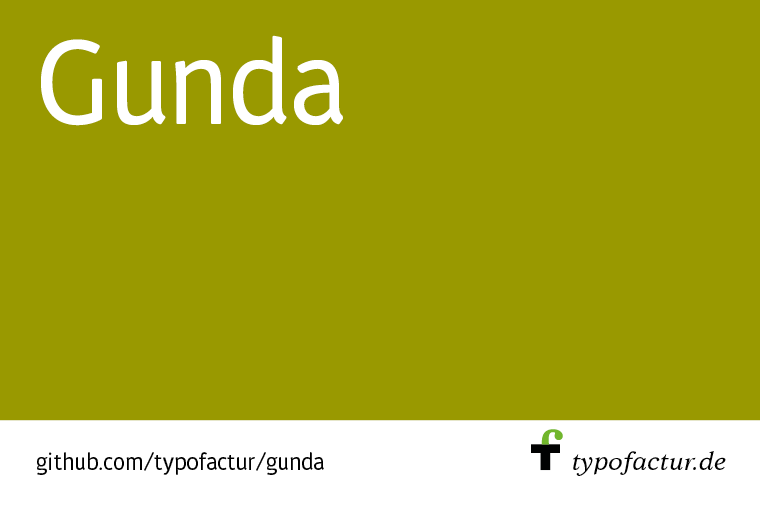
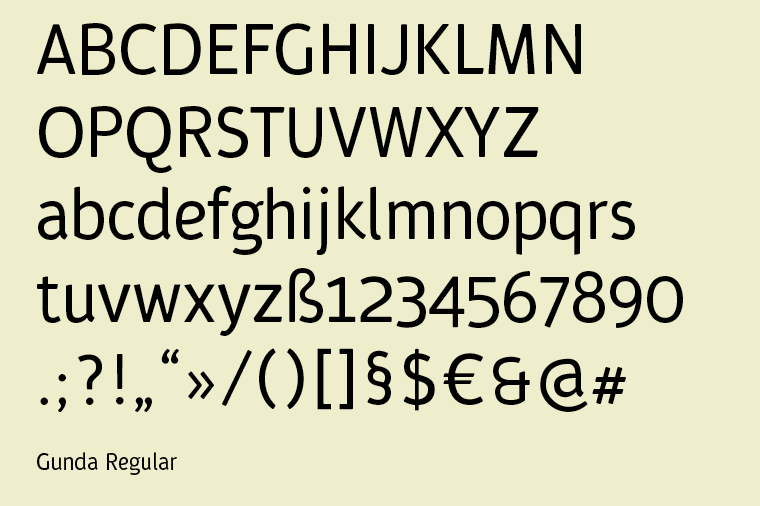
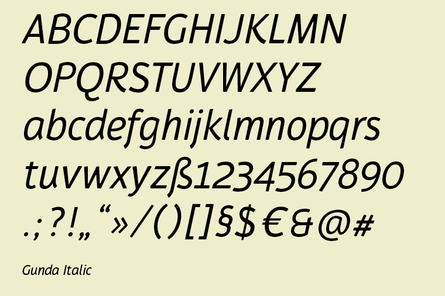

----

# Gunda

[![][Fontbakery]](https://typofactur.github.io/gunda/fontbakery/fontbakery-report.html)
[![][Universal]](https://typofactur.github.io/gunda/fontbakery/fontbakery-report.html)
[![][GF Profile]](https://typofactur.github.io/gunda/fontbakery/fontbakery-report.html)
[![][Shaping]](https://typofactur.github.io/gunda/fontbakery/fontbakery-report.html)

[Fontbakery]: https://img.shields.io/endpoint?url=https%3A%2F%2Fraw.githubusercontent.com%2Ftypofactur%2Fgunda%2Fgh-pages%2Fbadges%2Foverall.json
[GF Profile]: https://img.shields.io/endpoint?url=https%3A%2F%2Fraw.githubusercontent.com%2Ftypofactur%2Fgunda%2Fgh-pages%2Fbadges%2FGoogleFonts.json
[Outline Correctness]: https://img.shields.io/endpoint?url=https%3A%2F%2Fraw.githubusercontent.com%2Ftypofactur%2Fgunda%2Fgh-pages%2Fbadges%2FOutlineCorrectnessChecks.json
[Shaping]: https://img.shields.io/endpoint?url=https%3A%2F%2Fraw.githubusercontent.com%2Ftypofactur%2Fgunda%2Fgh-pages%2Fbadges%2FShapingChecks.json
[Universal]: https://img.shields.io/endpoint?url=https%3A%2F%2Fraw.githubusercontent.com%2Ftypofactur%2Fgunda%2Fgh-pages%2Fbadges%2FUniversal.json

Gunda is a legibel font with a casual and friendly appearance.

Gunda is a further development of Epunda. In contrast to strict Epunda Sans, it has softer forms that are reminiscent of handwriting, and not just in italics. The small e is also rounded in the regular style, and the tail of the double-storey g is open. The strokes are slanted and the corners are slightly rounded.

So far only the static styles Regular and Italic exist.

## About

typofactur is a German type foundry run by the graphic designer Simon Atzbach.
Find out more at https://typofactur.de

## Building

Fonts are built automatically by GitHub Actions - take a look in the "Actions" tab for the latest build.

If you want to build fonts manually on your own computer:

* `make build` will produce font files.
* `make test` will run [FontBakery](https://github.com/googlefonts/fontbakery)'s quality assurance tests.
* `make proof` will generate HTML proof files.

The proof files and QA tests are also available automatically via GitHub Actions - look at https://typofactur.github.io/gunda.git.

## Changelog

When you update your font (new version or new release), please report all notable changes here, with a date.
[Font Versioning](https://github.com/googlefonts/gf-docs/tree/main/Spec#font-versioning) is based on semver. 
Changelog example:

**23 December 2024. Version 1.000**
- initial release

## License

This Font Software is licensed under the SIL Open Font License, Version 1.1.
This license is available with a FAQ at https://openfontlicense.org

## Repository Layout

This font repository structure is inspired by [Unified Font Repository v0.3](https://github.com/unified-font-repository/Unified-Font-Repository), modified for the Google Fonts workflow.
